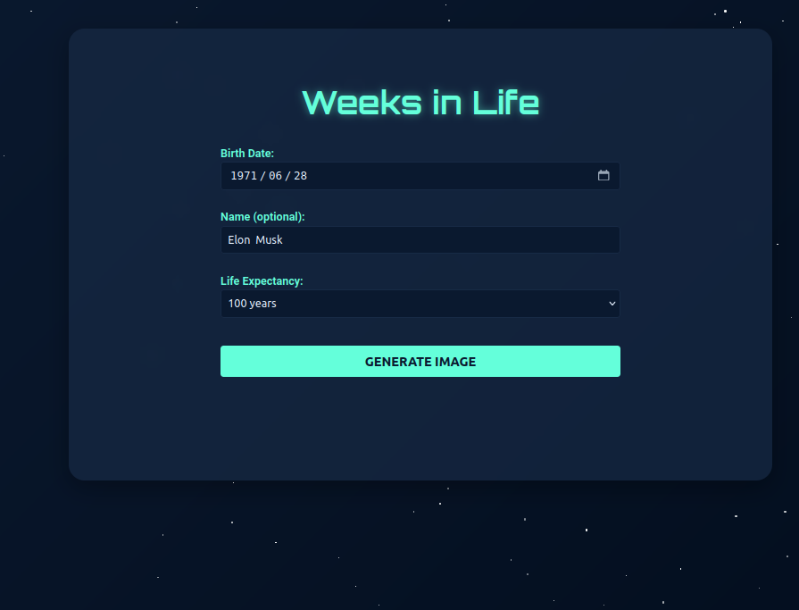
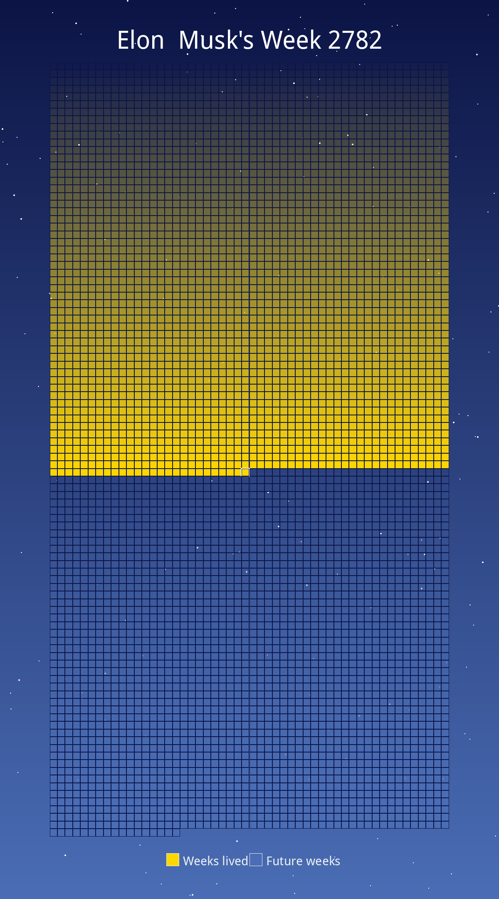

# Weeks in Life

This project helps you visually understand your life progress. Simply enter your birth date to calculate how many weeks you've lived and generate an image to display it.

## Main Features

- Calculate the number of weeks lived
- Generate a visual image: weeks lived are marked with one color, future weeks with another
- Provide 10 artistic color schemes based on famous paintings

### Artistic Color Schemes

Choose your favorite color scheme to create a unique life weeks image! Currently, the following 10 color schemes based on famous paintings are available:

1. Starry Night (Van Gogh)
2. Sunflowers (Van Gogh)
3. Water Lilies (Monet)
4. The Scream (Munch)
5. Girl with a Pearl Earring (Vermeer)
6. Café Terrace at Night (Van Gogh)
7. The Persistence of Memory (Dalí)
8. The Birth of Venus (Botticelli)
9. The Kiss (Klimt)
10. Mona Lisa (Da Vinci)

## Development Information

Developed using Flask for the backend, and HTML, CSS, JavaScript for the frontend. **Powered by Cursor.**


**Launch**

```sh
python3 app.py
```




